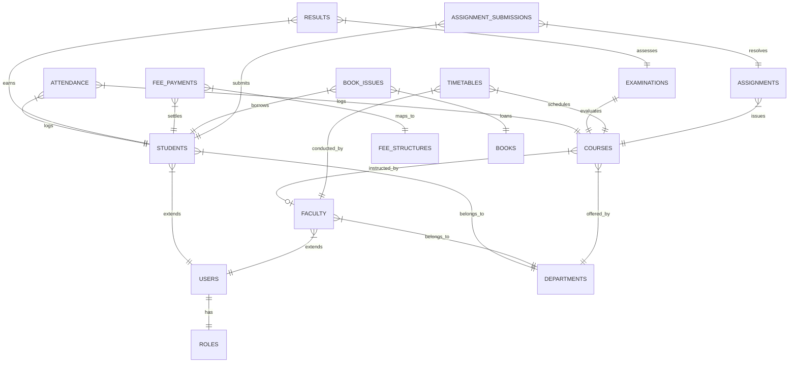

# UNIVERSITY SYSTEM ARCHITECTURE & TECHNICAL SPECIFICATION

## 1. SOFTWARE REQUIREMENT SPECIFICATION (SRS)

### 1.1 Introduction
The **University ERP Integrated Student Management System** is a 3-tier enterprise resource planning platform designed to unify all academic, administrative, and financial activities of a higher education institution.

### 1.2 User Roles & Access Boundaries
1. **Admin**: Master control panel access. Can manage students, faculty, departments, courses, and post announcements.
2. **Faculty**: Mark daily attendance, enter student examination marks, issue assignments, and view timetables.
3. **Student**: View real-time course attendance, academic grade transcripts, submit assignments, pay pending fees, and browse catalog books.
4. **Parent**: View ward grades, attendance, outstanding due balances, and print official fee receipts.
5. **Accountant**: Define fee structures, record payments, and export transaction audit journals.
6. **Librarian**: Catalog book titles, issue/return copies, and track fines.

---

## 2. DATABASE SYSTEM ARCHITECTURE (ER DIAGRAM)



---

## 3. CLASS DIAGRAM

```mermaid
classDiagram
    class User {
        +String id
        +String username
        +String email
        +String passwordHash
        +String name
        +Role role
    }
    class Student {
        +String id
        +String rollNo
        +String batch
        +Integer currentSemester
        +Double cgpa
        +String parentName
        +Department department
    }
    class Faculty {
        +String id
        +String designation
        +String specialization
        +Integer workloadHours
        +Department department
    }
    class Course {
        +String id
        +String name
        +String code
        +Integer credits
        +Faculty instructor
    }
    User <|-- Student : extends
    User <|-- Faculty : extends
    Student }--* Course : enrolls
```

---

## 4. REST API ENDPOINTS SPECIFICATION

| HTTP Verb | Path | Authenticated Role | Description |
| :--- | :--- | :--- | :--- |
| **POST** | `/api/auth/login` | Anonymous | Authenticate credentials and retrieve JWT. |
| **GET** | `/api/students` | Admin, Faculty, Accountant | Fetch filtered student profiles directory. |
| **POST** | `/api/students` | Admin | Create new student profile & register account. |
| **PUT** | `/api/students/{id}` | Admin | Modify specific student information. |
| **POST** | `/api/attendance` | Admin, Faculty | Mark course-wise student attendance rosters. |
| **POST** | `/api/results` | Admin, Faculty | Log exam grade details for CGPA calculations. |
| **POST** | `/api/fees/collect` | Admin, Accountant | Register offline receipt for student dues. |

---

## 5. INSTALLATION GUIDE & DEPLOYMENT INSTRUCTIONS

### 5.1 Local MySQL Database Configuration
1. Open your terminal or MySQL Workbench.
2. Run the SQL script found in `/database/schema.sql` to instantiate the database structure:
   ```bash
   mysql -u root -p < database/schema.sql
   ```

### 5.2 Spring Boot Backend Setup
1. Ensure Java JDK 17+ and Maven are installed.
2. Configure database credentials in `/src/main/resources/application.properties`:
   ```properties
   spring.datasource.url=jdbc:mysql://localhost:3306/university_erp
   spring.datasource.username=your_username
   spring.datasource.password=your_password
   ```
3. Boot the API Server:
   ```bash
   mvn spring-boot:run
   ```

### 5.3 React Frontend Setup
1. Open a new terminal session.
2. Install dependencies and start the Vite Dev Server:
   ```bash
   npm install
   npm run dev
   ```
